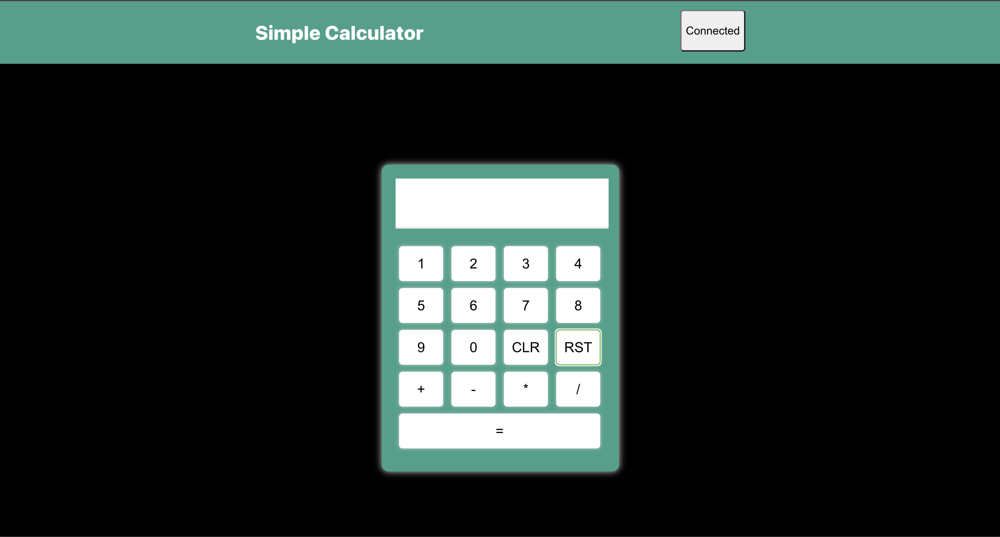

# Simple Calculator v2

## Overview

A calculator DApp that was built with React.js, Hardhat, Solidity. The front-end is hosted through [Fleek](https://fleek.co/) and the contract is deployed to the [zkSync](https://zksync.io/) Goerli Testnet2. This DApp requires a MetaMask account in order to use the calculator and must be [configured](https://v2-docs.zksync.io/dev/fundamentals/testnet.html#connecting-metamask) for the zksync testnet. Grab some fake ETH [here](https://goerlifaucet.com/)

## Link to DApp

https://cool-math-7566.on.fleek.co

## View Contract

View the contract through the zkSync v2 Block Explorer!
Contract address: 0xA3147b3860c6eC1fDc9434045Dd030cCE947c3c3

Test it out here: https://cool-math-7566.on.fleek.co/

## Layer 1 version

Check out the same DApp that is deployed to layer 1 to test out the transaction speed difference. Link to the [website](https://quiet-grass-6199.on.fleek.co) and [repo](https://github.com/justbytes/simple-calculator)
